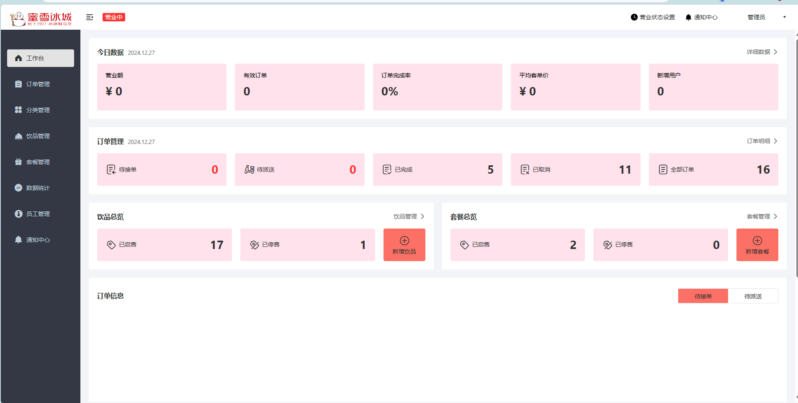
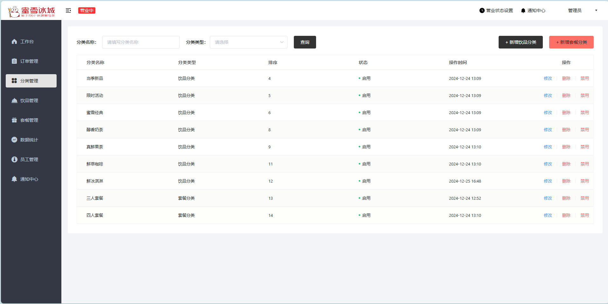
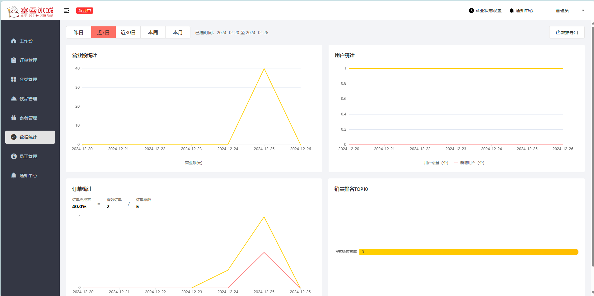
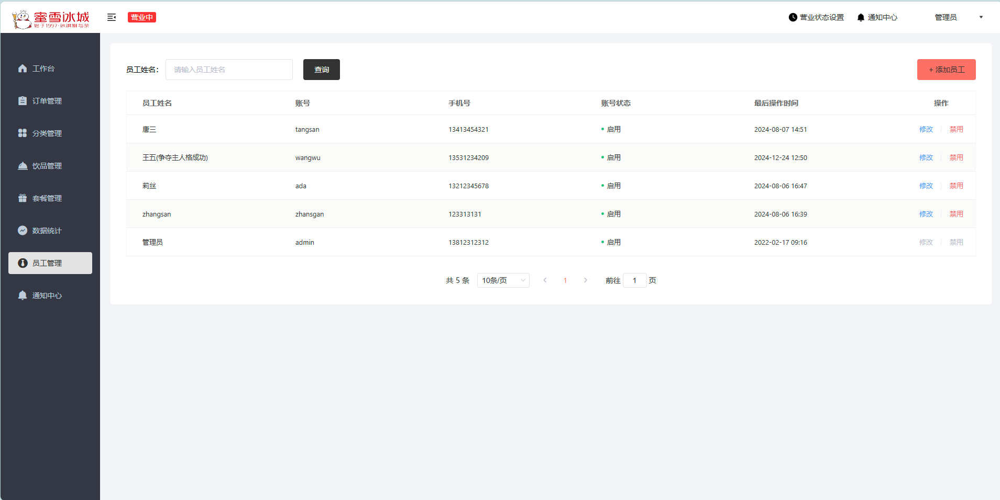

## 仿蜜雪冰城小程序奶茶点单系统

参考苍穹外卖，跳过微信支付(无商家微信)，解决员工端删除单个菜品时的异常问题

技术栈: `SpringBoot` `MyBatis` `Redis` `MySQL` `Nginx` `SpringCache` `SpringTask` `WebSocket` `Vue` `Maven` `Uni-app`












### 后端部署

1.运行`sky.sql`脚本

2.在idea打开`mxbc`文件夹

3.在`sky-server/src/main/resources/application-dev.yml`中修改数据库等配置信息

### 前端Vue快速启动

在`nginx-1.26.2`文件夹下双击`nginx.exe`

访问http://localhost:82即可

### 前端部署

1.在idea打开`mxbc-frontend`文件夹

2.安装yarn(如果没有)

```shell
npm install yarn -g
```

3.切换淘宝镜像源

```shell
yarn config set registry https://registry.npmmirror.com
```

4.禁用SSL证书验证

```shell
yarn config set strict-ssl false
```

5.增加yarn超时时间

```shell
yarn config set network-timeout 600000
```

6.安装依赖

```shell
yarn install
```

7.修改配置

.env.development开发环境

```js
# Base api
VUE_APP_BASE_API = '/api'

# vue-cli uses the VUE_CLI_BABEL_TRANSPILE_MODULES environment variable,
# to control whether the babel-plugin-dynamic-import-node plugin is enabled.
# It only does one thing by converting all import() to require().
# This configuration can significantly increase the speed of hot updates,
# when you have a large number of pages.
# Detail:  https://github.com/vuejs/vue-cli/blob/dev/packages/@vue/babel-preset-app/index.js

NODE_ENV = 'development'
VUE_APP_NODE_ENV = 'dev'

//后端服务的地址
VUE_APP_URL = 'http://localhost:8080/admin'

VUE_APP_SOCKET_URL = 'ws://localhost:8080/ws/'

VUE_CLI_BABEL_TRANSPILE_MODULES = true
# 删除权限 true/有
VUE_APP_DELETE_PERMISSIONS = true

```

8.运行

```shell
yarn serve
```

### 微信小程序快速启动

1.下载微信开发者工具

2.获取个人小程序Appid

3.将mp-weixin导入微信开发者工具，填写自己的Appid

4.设置->安全->开放端口

5.在common/vendor.js中配置baseUrl

6.若想真机调试，在微信小程序平台配置合法域名

### 小程序项目部署

1.在HBuilder X导入uniapp-hbuilder

2.在manifest.json配置微信小程序Appid

3.在工具->设置->运行配置->微信开发者工具路径中，选择具体的安装路径

4.运行到微信小程序

### Nginx配置

nginx.conf

```js

#user  nobody;
worker_processes  1;

#error_log  logs/error.log;
#error_log  logs/error.log  notice;
#error_log  logs/error.log  info;

#pid        logs/nginx.pid;


events {
    worker_connections  1024;
}


http {
    include       mime.types;
    default_type  application/octet-stream;

    #log_format  main  '$remote_addr - $remote_user [$time_local] "$request" '
    #                  '$status $body_bytes_sent "$http_referer" '
    #                  '"$http_user_agent" "$http_x_forwarded_for"';

    #access_log  logs/access.log  main;

    sendfile        on;
    #tcp_nopush     on;

    #keepalive_timeout  0;
    keepalive_timeout  65;

    #gzip  on;

    map $http_upgrade $connection_upgrade{
		default upgrade;
		'' close;
	}

	upstream webservers{
	  server 127.0.0.1:8080 weight=90 ;
	  #server 127.0.0.1:8088 weight=10 ;
	}


    server {
        listen       82;
        server_name  localhost;

        #charset koi8-r;

        #access_log  logs/host.access.log  main;

        location / {
           root  html;
           index  index.html index.htm;
        #    proxy_pass   http://127.0.0.1:5173/;
        }

        


	    location ^~ /api/ {
            proxy_pass   http://localhost:8080/admin/;
        }

        # 反向代理,处理用户端发送的请求
        location /user/ {
            proxy_pass   http://localhost:8080/user/;
        }

        # WebSocket
		location /ws/ {
            proxy_pass   http://localhost:8080/ws/;
			proxy_http_version 1.1;
			proxy_read_timeout 3600s;
			proxy_set_header Upgrade $http_upgrade;
			proxy_set_header Connection "$connection_upgrade";
        }
				


        #error_page  404              /404.html;

        # redirect server error pages to the static page /50x.html
        #
        error_page   500 502 503 504  /50x.html;
        location = /50x.html {
            root   html;
        }

        # proxy the PHP scripts to Apache listening on 127.0.0.1:80
        #
        #location ~ \.php$ {
        #    proxy_pass   http://127.0.0.1;
        #}

        # pass the PHP scripts to FastCGI server listening on 127.0.0.1:9000
        #
        #location ~ \.php$ {
        #    root           html;
        #    fastcgi_pass   127.0.0.1:9000;
        #    fastcgi_index  index.php;
        #    fastcgi_param  SCRIPT_FILENAME  /scripts$fastcgi_script_name;
        #    include        fastcgi_params;
        #}

        # deny access to .htaccess files, if Apache's document root
        # concurs with nginx's one
        #
        #location ~ /\.ht {
        #    deny  all;
        #}
    }


    # another virtual host using mix of IP-, name-, and port-based configuration
    #
    #server {
    #    listen       8000;
    #    listen       somename:8080;
    #    server_name  somename  alias  another.alias;

    #    location / {
    #        root   html;
    #        index  index.html index.htm;
    #    }
    #}


    # HTTPS server
    #
    #server {
    #    listen       443 ssl;
    #    server_name  localhost;

    #    ssl_certificate      cert.pem;
    #    ssl_certificate_key  cert.key;

    #    ssl_session_cache    shared:SSL:1m;
    #    ssl_session_timeout  5m;

    #    ssl_ciphers  HIGH:!aNULL:!MD5;
    #    ssl_prefer_server_ciphers  on;

    #    location / {
    #        root   html;
    #        index  index.html index.htm;
    #    }
    #}

}

```

